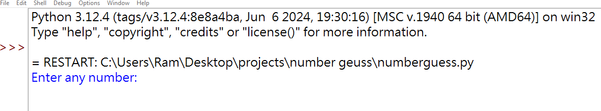

<h1>
  Number guess game
</h1>
<h3>
  Summary 
</h3>

  A Python guess game generates a random number within a specified range, challenging the user to guess it. The game provides feedback, such as "Too High" or "Too Low," to guide the user toward the correct number. The user continues guessing until the correct number is found, with the program optionally tracking the number of attempts. It typically uses the random module to generate the target number and input for user interaction. This game can be enhanced by adding features like difficulty levels, attempt limits, or hints, making it a simple yet engaging way to practice programming concepts.

<h4>
  The output while the code is running
</h4>

